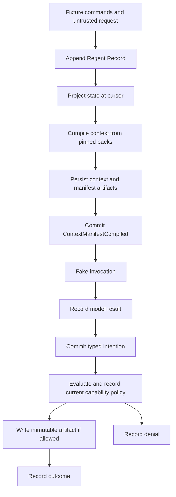

# Architecture

The machine is a single-process modular monolith. Its observable outcome is a
reconstructable development history: what was received, which context was shown,
what was proposed, why permission was granted or denied, and which artifact exists.
Its output cannot establish canonical legitimacy, truth of testimony, or moral
goodness. No canonical House has been born.

The architecture models the social and operational structure of work. It does not
prescribe a vocation or encode a research methodology. Generic context provenance
supports reconstruction of an actor's inputs; analytical claims, citations, and
inference labels may remain ordinary artifact content. See
[project intent](PROJECT_INTENT.md) for the threshold for adding vocational machinery.

Specify the physics of the House rigidly; specify its morality and practical
wisdom narratively. A mechanism should establish a declared guarantee or address
a need demonstrated through repeated experience, rather than preempt a judgment
an inhabitant ought to learn. Recording context, permission, and review preserves
accountability; it does not determine what work is worthwhile or what counts as
wise action. See the design question and examples in
[project intent](PROJECT_INTENT.md#rigid-physics-narrative-morality-and-practical-wisdom).

## Module boundaries

`domain/` owns concepts, command schemas, and state-dependent validation;
`events/` owns immutable envelopes and chain verification; `artifacts/` owns byte
identity; `projections/` derives current state; `context/` compiles attention;
`actors/` wraps the fake adapter; `capabilities/` mediates the sole effect;
`storage/` opens and migrates SQLite; `cli/` composes the disposable scenario.
Domain types do not depend on database row types.

`console/` is a separate operator surface within the repository. It reads pinned
host-rehearsal archives and maintains private operator chat and shared reading
position in its own development SQLite database. Its Codex App Server integration
does not use the House adapter, broker, or event store. See the
[Regent console](REGENT_CONSOLE.md) for its local access and recovery boundaries.

There is no concurrent worker scheduler, remote command ingress, or plugin loader.
The modular monolith keeps the order of persistence and effects visible and
allows transactionally checked commands without distributed infrastructure.
The broker assumes a single trusted runtime writer. Multiple independent effect
executors would require additional coordination before they could be supported.

## Ten invariants

These are the current runtime commitments. They are not a complete moral code.
Other procedural restrictions in the archival-storage workflow, such as when a
dispute can be raised and which resolution outcomes are supported, remain fixture
choices rather than universal laws of the House.

1. **Append before effect:** manifest commitment precedes invocation; intention and
   policy commitments precede capability execution. Artifacts referenced by events
   are persisted before the referencing commit.
2. **Append-only history:** application APIs offer no event update/delete. SQLite
   triggers reject both, and inserts must use the next contiguous sequence.
3. **Projected state:** domain validation reconstructs state from events under the
   append transaction. Persisted projections are disposable caches.
4. **Context as evidence:** selected and omitted packs, versions, hashes, sources,
   compiler version, exact rendered bytes, and the event cursor are retained.
5. **Explicit authority:** actor kind, office tenure, and capability grants are
   separate. The broker checks active lifecycle and current, bounded tenure.
6. **Interpretation cannot replace fact:** testimony and judgments append new
   events referencing previous events. They cannot change those events.
7. **Untrusted external content:** source/lane validation prevents external packs
   entering constitutional lanes. Structured rendering preserves boundaries.
8. **Provision is not payment:** financial, compute, and nonfinancial transfers
   have discriminated schemas and separate projections. No exchange rate exists.
9. **Dormancy is not death:** allowed transitions are unborn to active, active to
   dormant, and dormant to active. Compute exhaustion only allows active to dormant.
10. **Development is pre-birth:** all domain identities use `dev:`; database metadata
    states `development-unborn`; canon sources remain draft/unratified.

## Storage and failure semantics

Events use strict JSON: sorted object keys, preserved array order, finite numbers,
and no undefined values, sparse arrays, class instances, or cycles. Hashes cover
all envelope fields except `hash`, including sequence and previous hash. This is
the project's version-1 canonical encoding, not a claim of implementing every
cross-language canonicalization standard. IDs and clocks are injectable.
Sequence provides stream order; occurrence timestamps do not provide a separate
global clock or an ordering guarantee.

Appends use `BEGIN IMMEDIATE`; validation and sequence allocation happen under the
write transaction. SQLite uses WAL, a busy timeout, and synchronous FULL. Append
and replay refuse a chain that fails verification. Artifact references must exist
and verify before commit. An interrupted database operation cannot authorize an
effect whose required intention was not committed.

Artifacts are written to unique temporary files, synced, and atomically published
with an exclusive hard link at their SHA-256 name. Existing names are never
overwritten; an existing corrupt object causes failure. The directory is synced.
This implementation targets a local filesystem with these POSIX semantics.
An abrupt process or host failure can leave unreferenced objects or temporary
files; automatic garbage collection is outside this milestone. Persistence still
depends on filesystem and hardware honoring synchronization.

SQLite and artifact files do not share a transaction. Persisting referenced
objects first favors harmless unreferenced objects over committed missing bytes.
The model's artifact effect is a separate operation and still requires a recorded
intention before its object is created.

If the runtime stops after an artifact effect but before the result event, the
broker can reconcile a previously allowed intention with its verified expected
artifact. This establishes the desired bytes exist; it does not establish which
process first created deduplicated bytes. A completed intention returns its
existing result without repeating the effect. Failed or denied results are
terminal; a new attempt requires a new intention. A missing outcome remains
unresolved until explicitly reconciled. Replay never performs reconciliation.

## Trust and actual guarantees

The developer process is trusted. Its domain service is a local API, not an
authentication service. `recordedBy` labels record provenance and is not a
credential. The fake adapter receives detached context, not handles to the store
or broker; its structured output is validated before recording. Arbitrary code
running in the host process is outside this boundary.

The archival-storage workflow adds typed commission events and a derived projection
around the same record and broker. Explicit work checkpoints allow later CLI
processes to reuse recorded manifests, results, and intentions. Human feedback is
evidence; only the Neighbor's review can permit fulfillment. The Regent can resolve
a dispute by returning work to revision or review. See
[the durable commission workflow](OFFLINE_COMMISSION.md) for restart guarantees
and the scripted adapter's limits.

Office authorization is checked at effect time; context authority describes the
pinned historical cursor. Expired tenure or dormancy can therefore deny an
intention generated from formerly valid context. Testimony authors and commitment
acceptance are checked against the performing actor; judgment requires a current
office with the explicit judgment capability.

The event store records observations available to the runtime. Receiving testimony
is observable; the truth of its claims is not thereby verified. Financial fixtures
are asserted records, not evidence from a payment provider. Judgment is an
interpretation with an explicit author and office; no automatic sanctions or
moral scores are derived from it.

A hash chain alone cannot detect a consistent full rewrite or deletion of a final
suffix. `verify(checkpoint)` can compare against an independently retained sequence
and hash. A signed external checkpoint service is not implemented. Database
triggers protect ordinary application operations, not a storage administrator.

Testimony and appeal vocabulary is reserved independently of House offices and
model output. The bootstrap does not claim operational independence for a future
Witness or Seat; that requires an external authority and separate access control.
